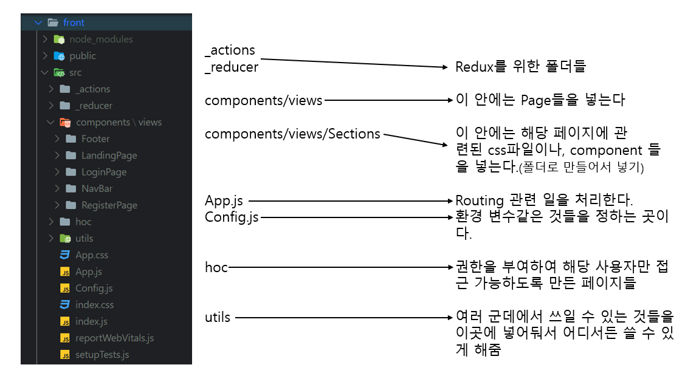

# SideProject_boilePlate
### 강의링크
- 인프런 react - node.js - 몽고DB(me:mysql) = boilerPlate / John Ahn 강의
https://www.inflearn.com/course/%EB%94%B0%EB%9D%BC%ED%95%98%EB%A9%B0-%EB%B0%B0%EC%9A%B0%EB%8A%94-%EB%85%B8%EB%93%9C-%EB%A6%AC%EC%95%A1%ED%8A%B8-%EA%B8%B0%EB%B3%B8#

### [mySQL 연동 참고 주소]
- 강의에서는 몽고DB를 사용했으나 여기서는 MySQL를 사용

https://github.com/dotcom7860/SideProject_nodeJs-MySQL

## 목적
- 웹 화면 구성에 기본이 되는 boilePlate을 React - node.js - mysql을 사용하여 만들어보기

## modules description
### backend
- body-parser : front에서 보내는 body 정보들
- concurrently : front, back 같이 실행
- mysql : back과 mysqlDB 커넥션
- nodemon : 소스가 바뀌면 서버를 자동으로 재실행
- express : nodejs의 표준 서버 프레임워크

### frontend
- react ~ : react를 사용하기 위한 것 
- react-router-dom : 보낼 페이지에 정확하고 최적의 경로로 보냄
- axios : front와 back의 연결고리
- http-proxy-middleware : 보내는 ip주소를 받는 곳의 ip주소로 변경시켜줌(원하지 않는 페이지 차단, ip주소가 변경되기에 보안에 Good)
- redux : react의 state값을 관리하기 위한 것
- redux-promise, redux-thunk : redux는 오브젝트(객체)로만 데이터를 받기에 funtion or promise로 왔을 때 어떻게 받아야하는지 알려줌
- antd : CSS를 가져다 씀(자세한 건 https://ant.design/)

## BoilerPlate 기본 구성
