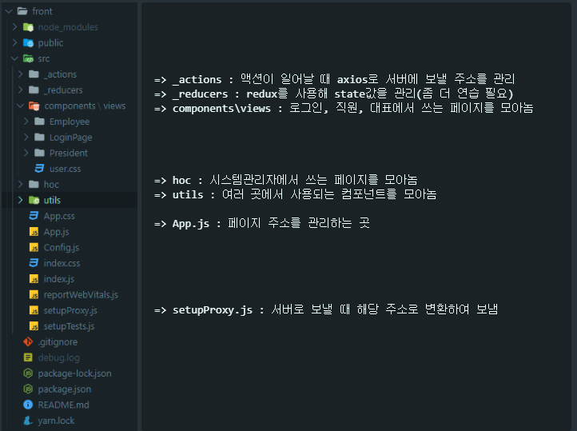
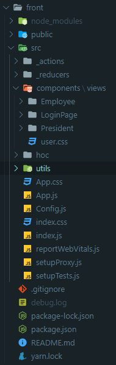
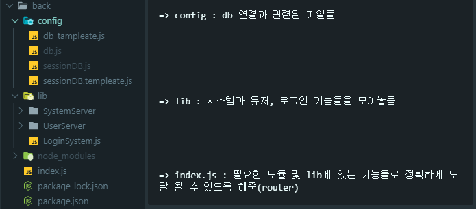
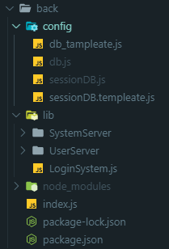

(배우는 과정이여서 미흡한 부분이 많습니다. 배우면서 계속 업데이트할 예정입니다.)
# 개발 도구
- CodeEditer : VS Code
- Front-End : React
- UI-Design : Ant Design
- Back-End : Nodejs
- Nodejs-FrameWork : Express
- DataBase : MySQL(server5.7)
- 소스 관리 및 공유 : Git, GitHub

# 사용 설명
## 실행 방법(CD_Project부터 시작하면 됩니다.)
### 사용할 모듈 다운로드
```
cd front -> npm install
//다시 뒤로 cd  ..
cd back -> npm install
```
### 실행 전 설정
```
[backend - DB 연결]
back/config 에 있는 db_tamplate.js와 sessionDB.template.js
파일을 복사하여 db.js, sessionDB.js로 만든 뒤 자신의 DB(mysql)정보를 입력합니다.

[DB 테이블 Create]
exampleDB.sql에 있는 테이블들을 만들어줍니다.
(스키마가 UTF-8인 상태에서 만들어야 합니다. 참조 : https://lazymankook.tistory.com/70)
```
### 실행(CD_Project에서 시작)
```
cd back -> npm run start
//다시 뒤로 cd ..
cd front -> npm run start
//로그인 페이지가 뜨면 성공입니다.
//root로 로그인하셔서 공통코드 및 직원관리를 사용하여 직원 및 대표로 로그인해보세요.
//비밀번호는 1111(수정할 예정)
```

# 추가적인 설명

- (front)


<!--   -->

- (back)


<!--   -->

# 사용하며 알아두면 좋은 것
- React_Hook(참고 : https://ko.reactjs.org/docs/hooks-intro.html)

- React_Redux(좀 더 공부가 필요함)(참고: https://react-redux.js.org/introduction/basic-tutorial)

- Express(참고 : https://expressjs.com/ko/guide/routing.html)

- AntDesign(참고 : https://ant.design/components/overview/)